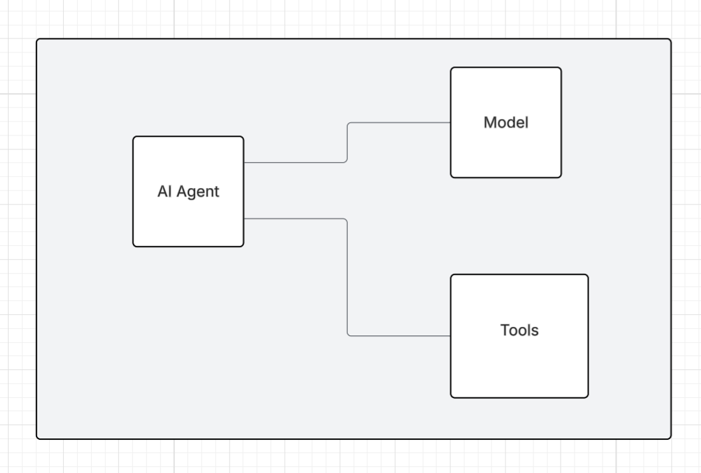
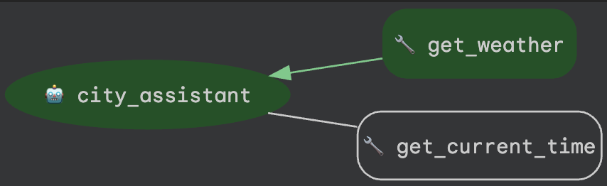

# City Assistant

## Overview

City Assistant is a lightweight AI agent that answers user questions about the
current local time and weather in any city. It interprets plain‑language city
names, resolves time zones, and surfaces up‑to‑date weather conditions and
forecasts. With real‑time integrations, it provides concise, reliable answers
like “What time is it in Tokyo right now?” or “What’s the weather in Paris this
afternoon?”.



## Agent Details

The key features of the City Assistant include:

| Feature | Description |
| --- | --- |
| **Interaction Type** | Conversational |
| **Complexity**  | Easy |
| **Agent Type**  | Single Agent |
| **Components**  | Tools |
| **Vertical**  | Travel |


### Agent architecture:

This diagram shows the detailed architecture of the agents and tools used
to implement this workflow.


## Setup and Installation

1.  **Prerequisites**

    *   Python 3.11+
    *   Poetry
        *   For dependency management and packaging. Please follow the
            instructions on the official
            [Poetry website](https://python-poetry.org/docs/) for installation.

        ```bash
        pip install poetry
        ```

    * A project on Google Cloud Platform
    * [uv](https://docs.astral.sh/uv/getting-started/installation) (to manage dependencies with Cloud run)
    * Google Cloud CLI
        *   For installation, please follow the instruction on the official
            [Google Cloud website](https://cloud.google.com/sdk/docs/install).

2.  **Installation**

    ```bash
    # Clone this repository.
    git clone https://github.com/dexcom-inc/dexcom-devops-cicd.git
    cd tools/ai-agents/city-assistant
    # Install the package and dependencies.
    # Note for Linux users: If you get an error related to `keyring` during the installation, you can disable it by running the following command:
    # poetry config keyring.enabled false
    # This is a one-time setup.
    poetry install
    ```

3.  **Configuration**

    *   Set up Google Cloud credentials.

        *   You may set the following environment variables in your shell, or in
            a `.env` file instead.

        ```bash
        export GOOGLE_GENAI_USE_VERTEXAI=true
        export GOOGLE_CLOUD_PROJECT=<your-project-id>
        export GOOGLE_CLOUD_LOCATION=<your-project-location>
        export GOOGLE_CLOUD_STORAGE_BUCKET=<your-storage-bucket>  # Only required for deployment on Agent Engine
        export PIRATE_WEATHER_API_KEY=<your_api_key_here> # to get weather data
        export GEOCODE_MAPS_API_KEY=<your_api_key_here> # to translate city to lat long
        ```

        or source `.env` file into environment

        ```bash
        set -o allexport && source .env && set +o allexport
        ```

    *   Authenticate your GCloud account.

        ```bash
        gcloud auth application-default login
        gcloud auth application-default set-quota-project $GOOGLE_CLOUD_PROJECT
        ```

    *   Enable Google Cloud APIs

        ```bash
        gcloud services enable compute.googleapis.com \
        cloudresourcemanager.googleapis.com \
        servicenetworking.googleapis.com \
        aiplatform.googleapis.com \
        run.googleapis.com \
        cloudbuild.googleapis.com \
        artifactregistry.googleapis.com
        ```

## Running the Agent

**Using `adk`**

ADK provides convenient ways to bring up agents locally and interact with them.
You may talk to the agent using the CLI:

```bash
adk run city_assistant
```

Or on a web interface:

```bash
 adk web
```

The command `adk web` will start a web server on your machine and print the URL.
You may open the URL, select "city_assistant" in the top-left drop-down menu, and
a chatbot interface will appear on the right. The conversation is initially
blank. Here are some example requests you may ask the City Assistant to verify:

```
what time is it in Tokyo right now
what's the weather in Paris today
will it rain in Seattle this afternoon
```

## Deployment

The City Assistant can be deployed to Vertex AI Agent Engine using the following
commands:

```bash
poetry install
poetry run python3 deployment/deploy.py --create
```

When the deployment finishes, it will print a line like this:

```
Created remote agent: projects/<PROJECT_NUMBER>/locations/<PROJECT_LOCATION>/reasoningEngines/<AGENT_ENGINE_ID>
```

For more information on deploying to Agent Engine, see [here](https://google.github.io/adk-docs/deploy/agent-engine/#install-vertex-ai-sdk) and [review setup docs](https://cloud.google.com/vertex-ai/generative-ai/docs/agent-engine/set-up)

If you forgot the AGENT_ENGINE_ID, you can list existing agents using:

```bash
poetry run python3 deployment/deploy.py --list
```

The output will be like:

```
All remote agents:

123456789 ("city_assistant")
- Create time: 2025-05-10 09:33:46.188760+00:00
- Update time: 2025-05-10 09:34:32.763434+00:00

```

You can also review agents from console:
- https://console.cloud.google.com/vertex-ai/agents/agent-engines

You may interact with the deployed agent using the `test_deployment.py` script
```bash
$ export USER_ID=<any string>
$ poetry run python3 deployment/test_deployment.py --resource_id=${AGENT_ENGINE_ID} --user_id=${USER_ID}
Found agent with resource ID: ...
Created session for user ID: ...
Type 'quit' to exit.
Input: Hello. What can you do for me?
Response: Hello! I'm an AI City Assistant. I can help you with questions around time and weather in a city.

To get started, please provide the city, time and weather you would like to analyse.
```

To delete the deployed agent, you may run the following command:

```bash
poetry run python3 deployment/deploy.py --delete --resource_id=${AGENT_ENGINE_ID}
```

## Alternate deployment to Cloud Run

### Create an Artifact Registry repository.

This is where we'll store the agent container image.

```bash
gcloud artifacts repositories create adk-agents \
  --repository-format=docker \
  --location=us-central1 \
  --description="Repository for ADK agents" \
  --project=$GOOGLE_CLOUD_PROJECT
```

### Containerize the ADK Python agent. 

Build the container image and push it to Artifact Registry with Cloud Build.

```bash
gcloud builds submit --region=us-central1 --tag us-central1-docker.pkg.dev/$GOOGLE_CLOUD_PROJECT/adk-agents/city-assistant:latest
```

### Deploy the agent to Cloud Run 

```bash
gcloud run deploy city-assistant \
  --image=us-central1-docker.pkg.dev/$GOOGLE_CLOUD_PROJECT/adk-agents/city-assistant:latest \
  --region=us-central1 \
  --allow-unauthenticated \
  --set-env-vars=GOOGLE_CLOUD_PROJECT=$GOOGLE_CLOUD_PROJECT,GOOGLE_CLOUD_LOCATION=us-central1,GOOGLE_GENAI_USE_VERTEXAI=TRUE,PIRATE_WEATHER_API_KEY=$PIRATE_WEATHER_API_KEY,GEOCODE_MAPS_API_KEY=$GEOCODE_MAPS_API_KEY
```
 
When this runs successfully, you should see: 

```bash
Service [city-assistant] revision [city-assistant-00001-d4s] has been deployed and is serving 100 percent of traffic.
```

### You can clean up this agent by:

- Deleting the [Artifact Registry](https://console.cloud.google.com/artifacts).
- Deleting the [Cloud Run Service](https://console.cloud.google.com/run).
